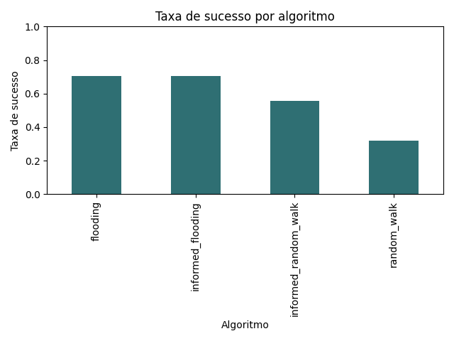
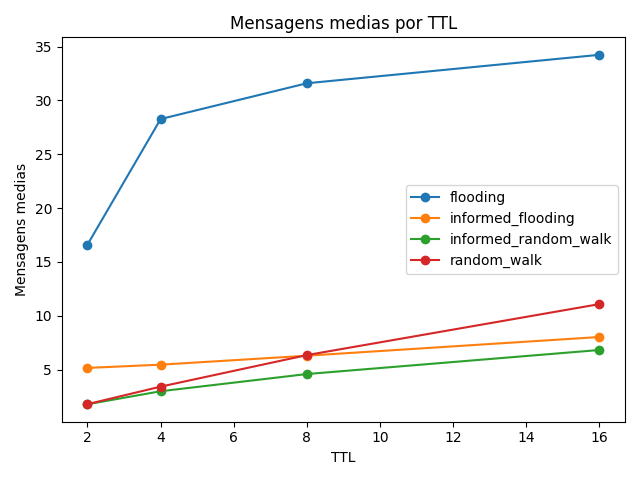

# Simulador de Busca em Redes P2P

## 1. Identificação da equipe

- Eduardo Célio Freire Lopes - 2120351
- Luiz Roberto Chaves De Tillio - 2418598
- Sara Pessoa Silva - 2120371

## 2. Funcionalidades implementadas

O programa implementa uma simulação de rede P2P não estruturada para comparar algoritmos de busca distribuída.

Principais funcionalidades:

- leitura da topologia da rede a partir de arquivo YAML;
- validação de conectividade da rede;
- validação de grau mínimo (`min_neighbors`) e grau máximo (`max_neighbors`) dos nós;
- validação de ausência de self-loops;
- validação de que todos os nós possuem ao menos um recurso;
- implementação dos algoritmos `flooding`, `informed_flooding`, `random_walk` e `informed_random_walk`;
- execução de buscas informando nó inicial, recurso procurado, TTL e algoritmo;
- coleta das métricas `total_messages`, `total_nodes_involved` e `resource_found`;
- geração de rastro passo a passo das mensagens enviadas durante a busca;
- interface de linha de comando para buscas e benchmarks;
- interface gráfica para carregar a rede, visualizar a topologia e animar as mensagens trocadas;
- execução de experimentos comparativos reprodutíveis com seed fixa;
- geração de CSV, tabela resumo e gráficos comparativos.

### Execução pela interface gráfica

```bash
python -m src.gui.app
```

### Execução de uma busca pela linha de comando

```bash
python -m src.cli.main search --config examples/line.yaml --node-id n1 --resource-id r5 --ttl 4 --algo flooding
```

### Execução dos testes comparativos

```bash
python -m src.cli.main benchmark
```

### Execução dos testes unitários

```bash
python -m pytest
```

## 3. Resultados dos testes comparativos

Os testes comparativos foram executados com as seguintes configurações:

- topologias: linha, anel, estrela e malha aleatória;
- tamanhos de rede: 10, 25, 50 e 100 nós;
- TTLs: 2, 4, 8 e 16;
- repetições por cenário: 30;
- métricas coletadas: mensagens totais, nós envolvidos e taxa de sucesso.

### Resumo por algoritmo

| Algoritmo | Média de mensagens | Média de nós envolvidos | Taxa de sucesso |
| --- | ---: | ---: | ---: |
| `flooding` | 27.68 | 23.71 | 70.31% |
| `informed_flooding` | 6.24 | 6.99 | 70.31% |
| `informed_random_walk` | 4.05 | 4.79 | 55.83% |
| `random_walk` | 5.67 | 5.78 | 31.87% |

### Análise dos resultados

Os resultados mostram que o `flooding` obteve a maior taxa de sucesso entre os algoritmos não informados, alcançando 70,31%. Esse comportamento é esperado, pois a busca por inundação envia mensagens para todos os vizinhos possíveis dentro do TTL, aumentando a chance de encontrar o recurso. O custo dessa abordagem é o maior volume de mensagens: em média, foram 27,68 mensagens por busca e 23,71 nós envolvidos.

O `informed_flooding` manteve a mesma taxa de sucesso do `flooding`, também com 70,31%, mas reduziu fortemente o custo da busca. A média caiu para 6,24 mensagens e 6,99 nós envolvidos. Isso indica que o uso de informação aprendida sobre a localização dos recursos tornou a busca mais eficiente, preservando o alcance do flooding quando o recurso estava dentro do TTL.

O `random_walk` apresentou o menor custo de comunicação, com 5,67 mensagens e 5,78 nós envolvidos em média, mas também teve a menor taxa de sucesso, com 31,87%. Isso ocorre porque a busca aleatória explora apenas um caminho por vez. Assim, mesmo consumindo poucas mensagens, ela pode seguir caminhos que não levam ao recurso dentro do limite de TTL.

O `informed_random_walk` melhorou a taxa de sucesso em relação ao `random_walk`, passando para 55,83%, e ainda reduziu a média de mensagens para 4,05. Esse resultado mostra que a informação aprendida ajuda a escolher caminhos mais promissores, mantendo baixo o custo de comunicação.

De forma geral, os testes evidenciam o compromisso entre alcance e custo. O flooding é mais robusto, mas gera mais tráfego na rede. As versões informadas tendem a ser mais eficientes porque reutilizam conhecimento adquirido durante buscas anteriores. Já o random walk reduz mensagens, mas perde taxa de sucesso quando comparado aos algoritmos de inundação.

### Gráficos

Taxa de sucesso por algoritmo:



Média de mensagens por TTL:



Arquivos gerados pelos experimentos:

- `results/benchmark_results.csv`
- `results/benchmark_summary.csv`
- `results/success_rate_by_algorithm.png`
- `results/messages_by_ttl.png`
